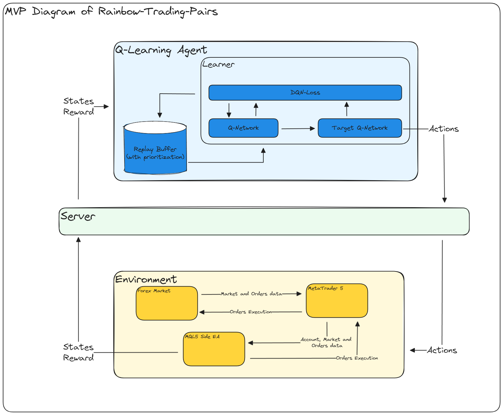

# Rainbow-Trading-Pairs

- [What is this?!](#what-is-this)
- [How to use](#how-to-use)

## What is this?!

**Rainbow-Trading-Pairs** is a Python code that uses Q-learning rainbow to trade pairs. It connects to MetaTrader5 and an EA on MT5 Execute Actions and sends Market States for this bot. The repository helps traders automate their trading process and make better decisions. The bot learns from its past experiences and improves its performance over time. The bot can execute trades and receive market states in real-time, making it a powerful tool for traders who want to stay ahead of the curve. **Rainbow-Trading-Pairs** is a valuable resource for anyone who wants to automate their trading process and improve their trading performance.

**A diagram illustrating its functionality is presented below.**

## How to use

**Warning : this project is developed <u>only</u> for research purposes.**

### prerequisites

1. MetaTrader 5
2. A c++ compiler (or any other easier ways for building a c++ dynamic library, *.dll*)
3. python 3.9 or higher with
	1. numpy
	2. ray
	3. pandas
	4. MetaTrader5
	5. torch
	6. threading
	7. IPython
	8. termcolor
	9. colorama
	10. matplotlib
	11. gymnasium
	12.  ...

### Realtime Mode

1. Clone this repository by **--recersive** flag
2. Copy **MQL5SideEA** folder to *Shared Folder* in MetaEditor
3. Build *WinSocketLib* to a *.dll* file. (I used *codeblocks*)
4. Compile `MainTRBotEA.mq5`
5. Add only those symbols you want to be traded in your market watch
6. Add the EA to a chart
7. Run the server  -->  `python RUN_TRServer.py`
8. Run RL agent    -->  `python Run_BSF_Algorithm.py`

**Note 1 : you can run the EA in strategy tester too.** 
**Note 2 : see `ConnectionWithMQL5/MaCrossExample.py` for an example.**

### Simulation Mode

1. Run `Simulator/OHLC_data_gathering.py` to gather needed data from MT5   -->  `python ./Simulator/OHLC_data_gathering.py`
2. Run `Run_MainRLAgent.py`  --> `python Run_MainRLAgent.py`

**Note : see `TwoCrossExample.py` for an example.**